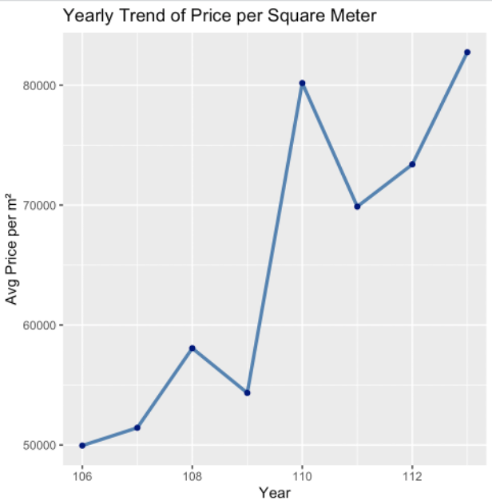
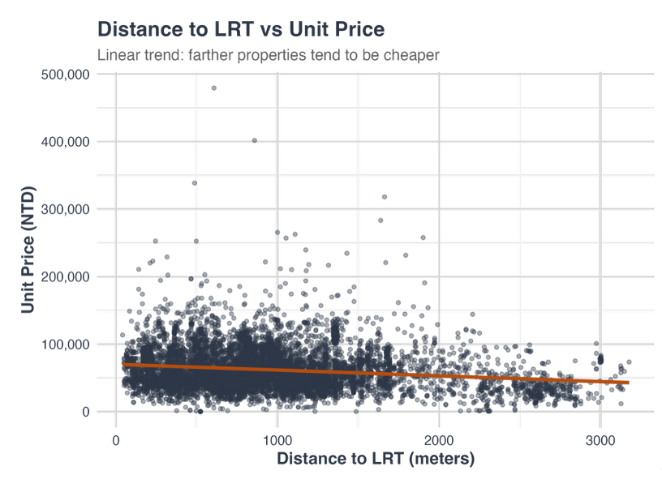
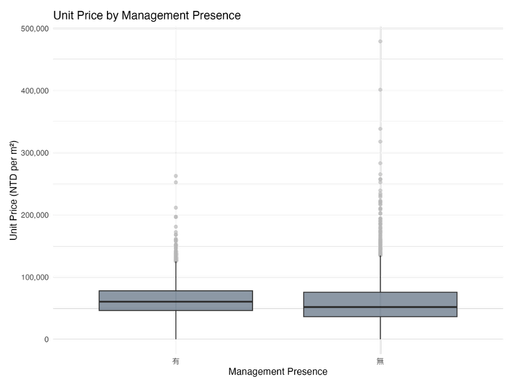
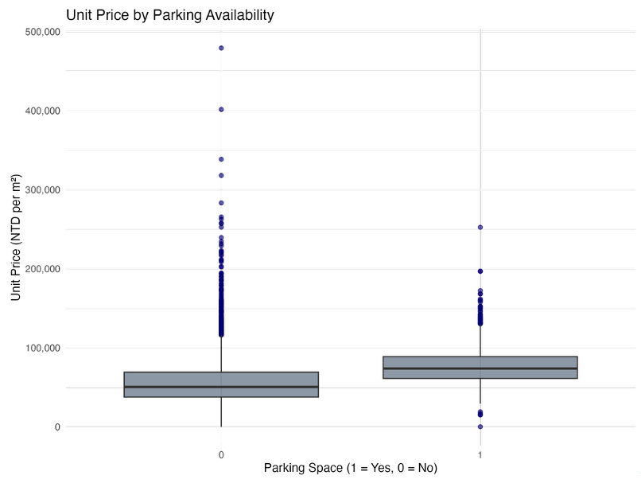

# Modeling the Impact of Factors on Housing Prices in Qianzhen District, Kaohsiung

**Authors:**

* 111ZU1059 Chou Yi Lin
* 112266002 Eric
* 111405182 Tzu Jui Wang
* 113266005 TENG Yun
* 112266009 Sawa Tatsuki

## 1. Introduction

In recent years, housing prices in Taiwan have experienced a rapid and sustained increase, prompting widespread concerns regarding housing affordability and the sustainability of urban development. According to the Ministry of the Interior (MOI), the national housing price index has shown a consistent upward trend since 2017, driven by factors such as persistently low interest rates, speculative investment in real estate, and urban population concentration (MOI, 2024). These developments have disproportionately affected younger and middle-income households, who increasingly find homeownership to be out of reach.

Among the cities undergoing notable transformation, Kaohsiung stands out for its rapid urban redevelopment. In particular, the Qianzhen District has transitioned from a primarily industrial zone into a mixed-use area combining residential, commercial, and public infrastructure. The establishment of transportation facilities such as Light Rail Transit has altered the landscape of the district, potentially reshaping the determinants of housing prices.

This study focuses on identifying the key drivers of housing prices in Qianzhen District by analyzing actual transaction data from 2017 to 2024. Using a multiple linear regression model, we examine the influence of property attributes such as building area, land area, number of rooms, age of the house, and the presence of parking or property management services. The goal is to provide a data-driven assessment of which factors significantly affect the unit price per square meter. The findings are expected to offer practical implications for urban policy, real estate development, and investment decision-making.

## 2. Research Problem

The primary aim of this research is to investigate the structural and locational factors that drive housing price variation in Kaohsiung’s Qianzhen District. As housing prices continue to climb, understanding the composition of price determinants becomes increasingly important for ensuring equitable and efficient urban development. This research is motivated by the need to provide empirical evidence on how various features of a property contribute to market value in a rapidly evolving urban environment.

**Core Research Question:**  
Which property-specific factors contribute most significantly to rising housing prices in Qianzhen District?

To answer this question, we analyze a set of key variables, including building area, land area, number of rooms and bathrooms, house age, and whether the property includes amenities such as parking or a management organization. The study employs a multiple linear regression model to estimate the extent to which each factor affects the unit price of housing, while controlling for the effects of other variables.

**Specific Objectives:**

1. To assess the relationship between structural characteristics (e.g., house age, room layout) and housing prices.
2. To evaluate the impact of additional features such as parking spaces and the presence of management organizations on property values.
3. To investigate whether traditional price determinants remain significant in an urban district undergoing rapid redevelopment.

By addressing these objectives, this research contributes to a better understanding of price formation mechanisms in urban housing markets and offers guidance for stakeholders including homebuyers, urban planners, and policymakers.

---

## 3. Data Description

### 3.1 Data Source and Scope

Property transaction records for this analysis were obtained through the Real Estate Actual Price Registration System (MOI, Taiwan) website, which provides public information on real estate transactions nationwide and records the actual transaction prices. The dataset includes detailed information such as the area of land and building transfer, the number of rooms, house age, and parking availability. This study uses transaction data from **January 2017 to November 2024**, focusing on the Qianzhen District to explore the influence of Kaohsiung's LRT system on residential property prices.

### 3.2 Key Variables

1. **Total Area of Land Transferred**  
   Expressed in square meters (m²). Larger land areas offer more development potential and tend to increase property value. *Expected coefficient: positive.*

2. **Total Area of Transferred Buildings**  
   Expressed in square meters (m²). Larger building areas usually increase property value. *Expected coefficient: positive.*

3. **Current Building Layout (Room)**  
   Number of rooms. More rooms usually raise buyer interest and property value. *Expected coefficient: positive.*

4. **Current Building Layout (Bathroom)**  
   Number of bathrooms. More bathrooms increase convenience and demand. *Expected coefficient: positive.*

5. **Current Building Layout (Living Room)**  
   Number of living rooms. Enhances comfort and appeal. *Expected coefficient: positive.*

6. **Age of Estates (age)**  
   Expressed in years. Older homes may be less desirable. *Expected coefficient: negative.*

7. **Parking Space**  
   Dummy variable (1 = has parking, 0 = none). Adds convenience and value. *Expected coefficient: positive.*

8. **Management Organization**  
   Dummy variable (1 = present, 0 = absent). Enhances quality and security. *Expected coefficient: positive.*

9. **Availability of Light Rail Transit Stations**  
   Dummy variable (1 = within 500m, 0 = outside). Improves accessibility. *Expected coefficient: positive.*

10. **Distance from Light Rail Transit Stations**  
    Expressed in meters. May be nonlinear in effect. *Expected coefficient: uncertain (positive or negative).*

### 3.3 Data Processing

To ensure the robustness of the regression analysis:

- **Outlier Removal:** Extreme cases (e.g., >1.4 billion NTD or >400 rooms) were excluded.
- **Missing Values:** Replaced with zeros.
- **Dummy Variables:** Created for parking and management presence.
- **Geocoding:** Transaction addresses were transformed into XY coordinates.
- **Final Sample Size:** After filtering, **9,642 valid transactions** remained for analysis.

## 4. Descriptive Statistics

* **Total Price**: Min = NT\$24,397, Max = NT\$243M, Avg = NT\$9.62M (SD = NT\$10.15M)
* **Building Area**: Min = 0.27 m², Max = 3,095.95 m², Avg = 150.78 m²
* **Land Area**: Min = 0 m², Max = 1,750 m², Avg = 31.83 m²
* **Rooms**: Avg = 3, Max = 15
* **Age**: Min = 0, Max = 72, Avg = 24 years

## 5. Methodology

### Model 1: Binary LRT Accessibility

```r
lm(`總價` ~ 房 + 廳 + 衛 + 車位 + 有無管理組織 + 屋齡 + 土地移轉面積 + 建物移轉面積 + lrt, data = data)
```

### Model 2: Linear Distance to LRT

Estimate marginal effect using `lrtdis` (in meters)

### Model 3: Quadratic Distance Model

```r
lm(`總價` ~ ... + lrtdis + I(lrtdis^2), data = data)
```

### Model 4: Segmented Regression (Threshold Estimate)

```r
library(segmented)
base_model <- lm(`總價` ~ ... + lrtdis, data = data)
model4 <- segmented(base_model, seg.Z = ~lrtdis)
```

## 6. Results and Visualization

| Model | Key Finding                                         | R²     |
| ----- | --------------------------------------------------- | ------ |
| 1     | Within 500m: +NT\$454,629 (p < 0.01)                | 0.6828 |
| 2     | Each meter: -NT\$1,239 (p < 0.001)                  | 0.6872 |
| 3     | Quadratic effect: negative curvature                | 0.6882 |
| 4     | Breakpoint: 1,518m; stronger negative effect beyond | 0.6885 |

**Figures:**

**Figures:**

  
  
  



## 7. Conclusion

* Building and land area positively affect prices.
* Age of property negatively affects price.
* Parking strongly increases price.
* Management presence has a slight negative effect, possibly due to property type.
* LRT proximity significantly increases value, especially within 1.5km range.

## References

* Ministry of the Interior. (2024). Real Estate Price Index. [https://pip.moi.gov.tw](https://pip.moi.gov.tw)
* Rosen, S. (1974). *Hedonic prices and implicit markets: Product differentiation in pure competition*. *Journal of Political Economy*, 82(1), 34–55.
